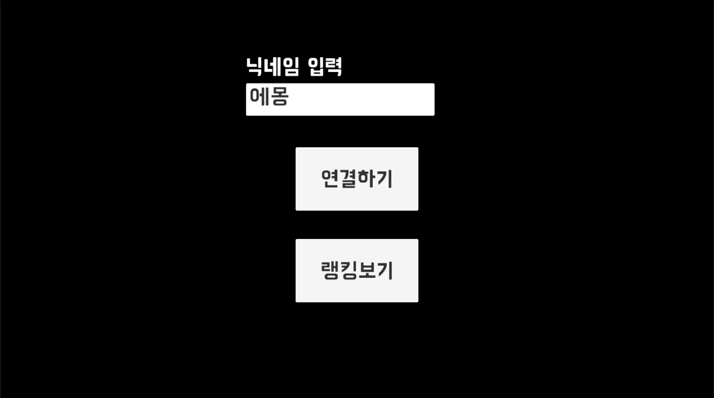
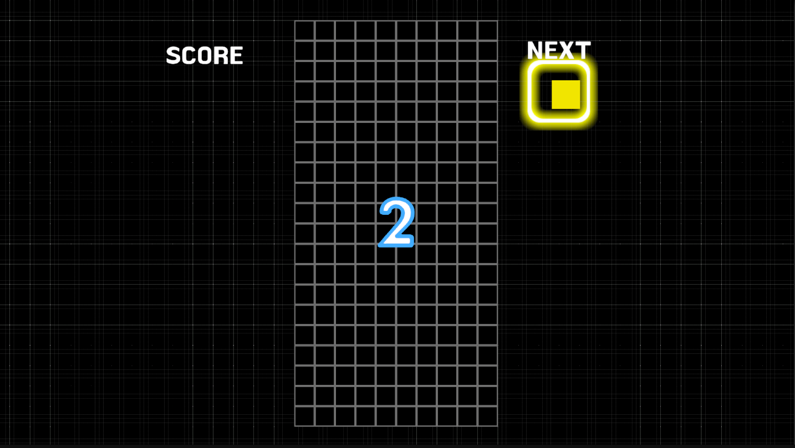
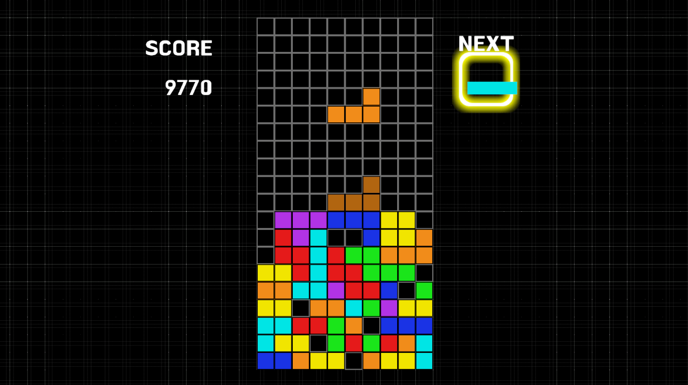
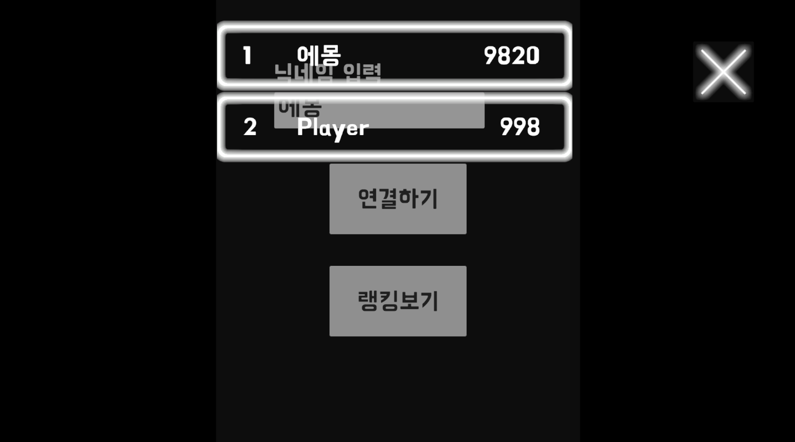

# Unity-Tetris 🎮🧱

Unity로 구현한 테트리스(Tetris) 게임 프로젝트입니다.  
기본 테트리스 플레이를 구현했으며, **TCP 서버와 연동된 랭킹 시스템**을 통해 점수를 서버로 전송하고 랭킹을 표시합니다.

---

## Gameplay Screenshots

  
  

  
  

---

## Game Flow

MenuScene

↓

GameScene

↓

Game Over

↓

TCP 서버로 점수 전송

↓

랭킹 화면 표시

- 메뉴 씬에서 게임 시작
- 게임 플레이 중 점수 누적
- 게임 종료 시 점수를 **TCP 서버로 전송**
- 서버에서 받은 랭킹 데이터를 UI로 표시

---

## Features

- 테트리스 기본 게임 로직
  - 블록 자동 낙하
  - 좌/우 이동 및 회전
  - 라인 완성 시 제거
  - 게임 오버 판정
- 점수(Score) 시스템
- **TCP 서버 연동 랭킹 시스템**
  - 게임 종료 시 점수 전송
  - 서버로부터 랭킹 데이터 수신
  - 랭킹 UI 표시

---

## Controls

- **← / →** : 블록 좌우 이동  
- **↓** : 소프트 드랍  
- **↑** : 블록 회전  
- **Space** : 하드 드랍  

---

## Project Structure

Assets/
 
 ├ Docs/                  # README용 스크린샷
 
 ├ Fonts/
 
 ├ Prefab/
 
 │  ├ BGBlock
 
 │  ├ Block
 
 │  ├ GameScene
 
 │  ├ RankingSlot
 
 │  └ TcpRankClient
 
 ├ Resources/
 
 ├ Scenes/
 
 │  ├ MenuScene
 
 │  └ GameScene
 
 ├ Scripts/
 
 │  ├ CameraShake
 
 │  ├ ENV
 
 │  ├ GameSession
 
 │  ├ MainMenuController
 
 │  ├ RankingPanel
 
 │  ├ RankingSlotUI
 
 │  ├ ServerApi

 │  ├ SetRanking

 │  ├ TcpRankClient
 
 │  ├ TetrisGame
 
 │  └ TextMeshPro_OutlineObject
 
 └ Settings/

 ---

## Core Scripts Overview

TetrisGame
테트리스 핵심 로직 관리 (블록 생성, 이동, 충돌, 라인 제거)

GameSession
게임 상태 및 점수 관리

TcpRankClient
TCP 서버와의 통신 담당 (점수 전송, 랭킹 수신)

RankingPanel / RankingSlotUI
서버에서 받은 랭킹 데이터를 UI로 표시

ServerApi / SetRanking
랭킹 데이터 설정 및 처리 로직

---

## Tech Stack

Engine: Unity

Language: C#

Network: TCP Socket

Platform: PC (Unity Editor)

---

## Implementation Notes

Grid 기반 보드 시스템으로 충돌 판정

블록 회전 시 유효성 검사 후 적용

라인 제거 후 상단 블록 재정렬

게임 종료 시 점수를 TCP 서버로 전송

서버 응답 기반 랭킹 UI 구성

---

## Future Improvements

 Next Block 미리보기

 Hold 시스템

 Ghost Piece

 레벨/속도 증가 시스템

 사운드 및 이펙트 추가

 랭킹 페이징 / 정렬 옵션

 ---

## Author

GitHub: https://github.com/MaoEmong

